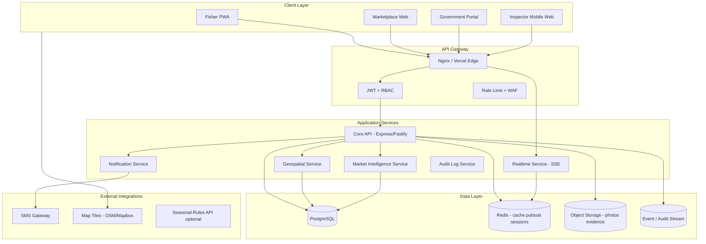
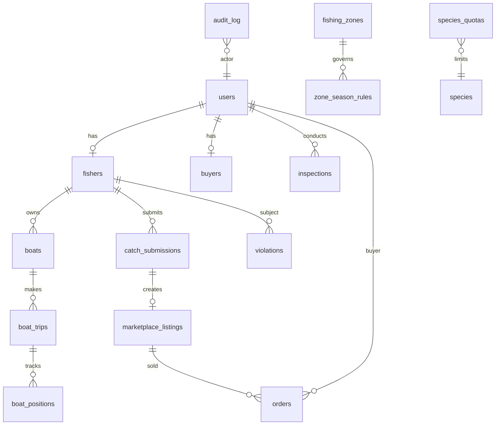
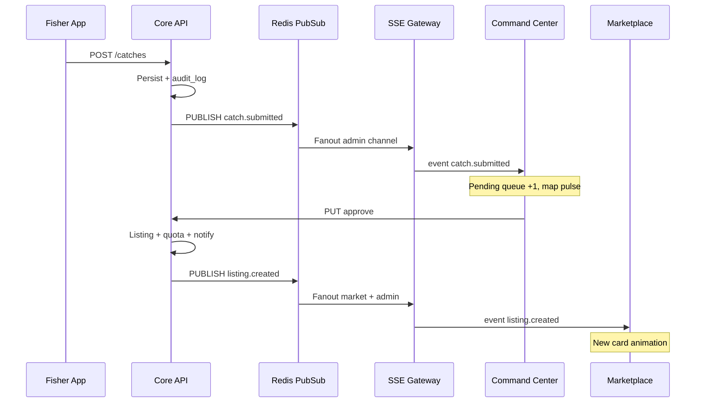

Here is an enterprise architecture blueprint grounded in your **current MVP** (3 Vite apps, Express + SQLite, 4 roles, polling) and aligned with your existing **ASSA PRD v2.0** vision (PostgreSQL, SSE, inspectors, production ops).

---

# ASSA Enterprise Fisheries Platform — Architecture Blueprint

## Executive framing: today vs. target

| Dimension      | Today (MVP)                        | Target (government-grade)                                                |
| -------------- | ---------------------------------- | ------------------------------------------------------------------------ |
| **Users**      | Fisher, Buyer, Admin, Superadmin   | + **Inspector/Enforcement**, **Market Analyst**, **Regional Supervisor** |
| **Apps**       | 3 siloed SPAs on ports 3001–3003   | **Unified portal** + role shells + mobile PWA                            |
| **Data**       | SQLite, 11 tables                  | **PostgreSQL** + **Redis** + audit/event store                           |
| **Real-time**  | 10–15s HTTP polling                | **SSE/WebSocket** + live activity bus                                    |
| **Maps**       | GPS as text on zone cards          | **Lake Tana command map** (zones, boats, heatmaps, violations)           |
| **Market**     | Listings + basic stats             | **Full market intelligence** (buyers, sellers, prices, supply chain)     |
| **Compliance** | Catch approve/reject, quota alerts | **Geofencing, violations, fines, inspector workflow**                    |
| **Boats**      | Static registry (name, capacity)   | **Live GPS tracks**, status, route history                               |

The MVP already proves the **core chain**: Fisher submits → Admin verifies → Marketplace lists → Buyer orders. The gap is **visibility, enforcement depth, and operational command** — not the basic workflow.

---

## 1. Full system architecture

### 1.1 Logical architecture (target)



### 1.2 Application decomposition (recommended)

| Service                 | Responsibility                                     | Notes                            |
| ----------------------- | -------------------------------------------------- | -------------------------------- |
| **Identity & RBAC**     | Users, roles, permissions, digital fisher ID       | Extend roles beyond 4            |
| **Licensing**           | Licenses, boats, permits, expiry, compliance score | Link to violations               |
| **Catch & Compliance**  | Submissions, zones, geofence checks, violations    | Enforce quota on approve         |
| **Fleet & Tracking**    | Boat positions, trips, status machine              | New tables + ingest API          |
| **Marketplace**         | Listings, orders, price history                    | Dynamic pricing optional         |
| **Market Intelligence** | Aggregations, forecasts, anomaly detection         | Read models / materialized views |
| **Inspection**          | Assignments, reports, fines, evidence              | Inspector role                   |
| **Realtime**            | SSE channels per role/region                       | Redis pub/sub                    |
| **Reporting**           | Exports, PDF, ministry dashboards                  | Scheduled jobs                   |

### 1.3 Deployment topology (production)

Single-domain pattern (matches your Vercel plan):

- `https://assa.gov.et/` → Government portal (admin + inspector + analytics)
- `https://assa.gov.et/market` → Public marketplace
- `https://assa.gov.et/fisher` → Fisher PWA
- `https://assa.gov.et/api` → Backend API (Render/Fly/VM with persistent disk → later Postgres)
- `https://assa.gov.et/realtime` → SSE endpoint

**Phase 1:** Monolith API + Postgres + Redis on one region (e.g. Bahir Dar / Addis proximity).  
**Phase 2:** Split realtime + analytics workers if load grows.

---

## 2. Dashboard layouts by user role

### 2.1 Government / Admin — **National Command Center**

**Layout:** Enterprise shell — collapsible sidebar, top command bar, **3-column main** on large screens.

```
┌─────────────────────────────────────────────────────────────────────────────┐
│ ASSA Command Center │ Lake Tana │ LIVE ● │ Alerts(12) │ Dawit ▼              │
├──────────┬──────────────────────────────────────────────────┬───────────────┤
│ NAV      │  CENTER (60%)                                    │ RIGHT RAIL    │
│          │  ┌─────────┬─────────┬─────────┬─────────┐      │ Live Feed     │
│ Overview │  │Catch kg │Active   │Live     │Revenue  │      │ • Order #4521 │
│ Live Ops │  │ today   │fishers  │orders   │ today   │      │ • Catch pend. │
│ Market   │  └─────────┴─────────┴─────────┴─────────┘      │ • Violation   │
│ Map      │  [ Lake Tana MAP - zones + boats + heat ]      │               │
│ Fleet    │  [ Tabs: Catches | Transactions | Violations ]   │ Market Pulse  │
│ Quotas   │  [ Sparkline charts - species / price ]          │ Tilapia ↑12%  │
│ Inspect. │                                                  │ Shortage warn │
│ Reports  │                                                  │               │
│ Settings │                                                  │ Quick Actions │
└──────────┴──────────────────────────────────────────────────┴───────────────┘
```

**Primary nav modules (build on existing pages + new):**

| Module                      | MVP today                 | Enterprise add                                  |
| --------------------------- | ------------------------- | ----------------------------------------------- |
| **Command Overview**        | Dashboard KPIs + 2 charts | Live KPIs via SSE, market heatmap strip         |
| **Live Operations**         | Daily catches (polling)   | Real-time transaction ticker, pending queue     |
| **Market Monitor**          | Reports (monthly only)    | Buyer/seller graph, price by species, shortages |
| **Lake Map**                | Zones as text list        | Interactive map: zones, boats, violations       |
| **Fleet Tracking**          | Fishers table (boat name) | Live boat markers + route history               |
| **Quotas & Sustainability** | Quota bars                | Daily/weekly limits, hard stop on approve       |
| **Inspections**             | —                         | Assignments, suspicious fishers, fines          |
| **Compliance Registry**     | Fishermen read-only       | License CRUD, boat registration, scores         |
| **Intelligence**            | —                         | Demand forecast, regional compare               |
| **Alerts & Incidents**      | Alerts page               | SLA, assign, escalate, resolve                  |

**Key panels for your requirements:**

**A) Market monitoring**

- **Who buys / who sells:** Network graph (buyer ↔ listing ↔ fisher) + tables
- **Species traded:** Stacked area chart by day; filter by zone
- **Price changes:** Line chart per species with 7d/30d; anomaly flags (>2σ)
- **Demand analytics:** Orders/kg vs verified catch kg (supply/demand gap)
- **Shortages:** `verified_kg - sold_kg` by species when negative → red alert
- **Suspicious activity:** Rapid repeat orders, price undercutting, fisher in prohibited zone
- **Supply chain:** Sankey: Catch → Listing → Order → (optional) Delivery hub

**B) Real-time dashboard**

- SSE-driven counters: catch today, active fishers (GPS <30m), boats fishing, orders/min, revenue
- **Activity log** (append-only, filterable)
- **Market heatmap** on map layer (order density by zone)

### 2.2 Inspector / Enforcement — **Field Operations Console**

**Layout:** Tablet-first, simplified command center.

```
┌────────────────────────────────────────┐
│ Inspector │ Assigned: 4 │ Synced ●       │
├────────────────────────────────────────┤
│ TODAY'S ASSIGNMENTS                    │
│ □ Zone West - quota spot check         │
│ □ Fisher Kebede Molla - license exp.   │
├────────────────────────────────────────┤
│ MAP (current patrol route)             │
│ [ GPS + restricted zones overlay ]     │
├────────────────────────────────────────┤
│ + New Inspection                       │
│ + Report Violation (photo + GPS)       │
│ HISTORY | FINES PENDING                │
└────────────────────────────────────────┘
```

**Capabilities:** assignment list, offline-capable forms (PWA), violation report with photos, link to catch/fisher/boat, fine draft → admin approval, inspection history.

### 2.3 Fisher — **Field Operations PWA** (enhance current fisher-app)

Keep mobile-first; add:

- **Live zone map** on submit step (geofence warning before submit)
- **License digital ID** (QR for inspectors)
- **Boat status** (start trip / end trip → enables fleet tracking)
- **Compliance score** + violation notices
- **Market link:** “Your listings” earnings today (SSE)

### 2.4 Buyer / Market actor — **Marketplace + optional B2B portal**

Current marketplace is strong base. Add:

- **Price history** sparkline on listing card
- **Verified supply badge** with catch reference (already partial)
- **Regional filter** (Bahir Dar, Gondar, etc.)
- For **government view:** same data in admin Market Monitor (not a separate buyer app)

### 2.5 Regional Supervisor (optional role)

Subset of admin: one **region_id** — sees only their zones/fishers/transactions. Important for Amhara multi-district deployment.

---

## 3. Database schema (enterprise extension)

### 3.1 Keep from MVP (migrate to PostgreSQL)

Existing 11 tables remain the **core domain**: `users`, `fishers`, `boats`, `fishing_zones`, `catch_submissions`, `marketplace_listings`, `orders`, `species_quotas`, `alerts`, `notifications`, `buyers`.

### 3.2 New / extended tables (critical)

```sql
-- Roles: extend users.role
-- fisher | buyer | admin | superadmin | inspector | market_analyst | regional_admin

-- REGIONS & SEASONAL RULES
regions (id, name, code)
zone_season_rules (id, zone_id, species, season_start, season_end, rule_type, max_kg)

-- BOAT TRACKING
boat_trips (id, boat_id, fisher_id, started_at, ended_at, status)
boat_positions (id, boat_id, trip_id, lat, lng, speed, heading, recorded_at)
boat_status enum: DOCKED | EN_ROUTE | FISHING | RETURNING | OFFLINE

-- REAL DEVICE GPS ON CATCH
-- catch_submissions: use client gps_lat/lng; validate against zone polygon

-- VIOLATIONS & ENFORCEMENT
violations (id, fisher_id, boat_id, zone_id, catch_id nullable,
  type, severity, description, lat, lng, reported_by_user_id,
  status, fine_amount, created_at)
inspections (id, inspector_id, fisher_id, zone_id, scheduled_at,
  completed_at, outcome, notes)
inspection_evidence (id, inspection_id, file_url, type)

-- MARKET INTELLIGENCE
price_history (id, species, zone_id nullable, price_per_kg, recorded_at, source)
market_snapshots (id, snapshot_date, species, total_listed_kg, total_sold_kg,
  avg_price, demand_index)

-- SUPPLY CHAIN (optional V2)
supply_chain_nodes (id, type: LANDING|HUB|MARKET, name, location)
order_fulfillment (id, order_id, from_node_id, to_node_id, status)

-- AUDIT & EVENTS (non-negotiable for government)
audit_log (id, actor_user_id, action, entity_type, entity_id,
  payload_json, ip, created_at)
domain_events (id, event_type, payload_json, created_at)  -- for SSE replay

-- COMPLIANCE SCORING
fisher_compliance (fisher_id, score, violations_count, last_violation_at, updated_at)

-- BUYER/SELLER ANALYTICS READ MODELS (materialized)
mv_daily_market_by_species ...
mv_buyer_activity ...
mv_seller_activity ...
```

### 3.3 Entity relationship (extended)



### 3.4 Geofencing model

- Store zone boundaries as **GeoJSON polygons** (not just center lat/lng).
- On catch submit: `ST_Contains(zone.geom, point)` → set `zone_flag` + block if PROHIBITED.
- On boat position ingest: if point in PROHIBITED while status=FISHING → auto-create violation + SSE alert.

---

## 4. Real-time system design

### 4.1 Pattern: **Event bus + SSE** (matches PRD v2.0)



### 4.2 SSE channels (role-scoped)

| Channel              | Subscribers    | Events                                                                                                               |
| -------------------- | -------------- | -------------------------------------------------------------------------------------------------------------------- |
| `admin:global`       | Command center | `catch.submitted`, `catch.verified`, `order.placed`, `violation.created`, `quota.warning`, `boat.entered_restricted` |
| `admin:region:{id}`  | Regional admin | Same, filtered                                                                                                       |
| `fisher:{userId}`    | Fisher app     | `catch.approved`, `catch.rejected`, `violation.notice`                                                               |
| `market:public`      | Marketplace    | `listing.created`, `listing.updated`, `order.placed` (anonymized)                                                    |
| `inspector:{userId}` | Inspector      | `assignment.created`, `alert.zone`                                                                                   |

### 4.3 Live data definitions

| Metric            | Source                                                | Update frequency      |
| ----------------- | ----------------------------------------------------- | --------------------- |
| Fish caught today | `SUM(catch_submissions.quantity_kg)` verified+PENDING | SSE on submit/approve |
| Active fishers    | GPS ping < 15 min                                     | Boat position ingest  |
| Boats fishing     | `boat_trips.status = FISHING`                         | Trip start/end        |
| Live transactions | `orders` stream                                       | SSE on order          |
| Stock available   | `SUM(listings.quantity_available_kg)`                 | On listing change     |
| Revenue today     | `SUM(orders.total_price)`                             | SSE on order          |

### 4.4 Fallback

- TanStack Query with `staleTime` + SSE invalidation (already ideal for your React apps).
- If SSE drops: degrade to 5s polling on command center only.

---

## 5. User flows (interconnected)

### 5.1 Catch-to-market (enhanced)

1. Fisher starts **trip** → boat status FISHING, GPS stream begins.
2. Fisher submits catch with **device GPS** → geofence check → PENDING.
3. **SSE** → Admin pending queue + map marker + activity log.
4. Admin reviews on **map + detail panel** (photos, quota bar, compliance score).
5. If quota exceeded → **block approve** (MVP only warned).
6. Approve → listing + price_history row + fisher notification + **SSE** to marketplace.
7. Buyer orders → order row + decrement stock + **SSE** → admin revenue + market activity.
8. All steps write **audit_log**.

### 5.2 Violation / enforcement

1. Boat enters prohibited zone OR inspector finds issue.
2. Create `violations` record + evidence.
3. Compliance score recalculated.
4. SSE → admin incidents + fisher notification.
5. Admin or system generates **fine** → inspector confirms delivery.
6. License status → SUSPENDED if threshold breached.

### 5.3 Market intelligence (batch + near-real-time)

- Nightly job: `market_snapshots` from orders + listings.
- Admin **Intelligence** page: forecasts (simple: moving average + seasonality), shortage warnings.
- Anomaly job: flag buyer placing >X kg/day or price 30% below 7d avg.

---

## 6. Missing enterprise features (prioritized)

| Priority | Feature                                                       | Why evaluators care                |
| -------- | ------------------------------------------------------------- | ---------------------------------- |
| P0       | **Command map** (zones + boats + heatmap)                     | “This is a real monitoring system” |
| P0       | **SSE live dashboard**                                        | Interconnection demo in 5 minutes  |
| P0       | **Market monitor** (buyers, sellers, species, revenue)        | Total market visibility            |
| P0       | **Inspector role + violation workflow**                       | Enforcement credibility            |
| P0       | **Audit log**                                                 | Government accountability          |
| P1       | **Boat GPS tracking** (simulated OK for demo)                 | Fleet control story                |
| P1       | **Geofence on submit**                                        | Zone protection                    |
| P1       | **Quota hard enforcement**                                    | Sustainability                     |
| P1       | **PostgreSQL + migrations**                                   | Production path                    |
| P2       | Price forecasting, supply chain nodes, SMS, offline inspector |                                    |
| P2       | Digital signatures, Amharic i18n, national multi-lake         |                                    |

---

## 7. Screens to build (inventory)

### Government portal (new shell — merge admin + extensions)

| Screen ID | Name                                           | Priority |
| --------- | ---------------------------------------------- | -------- |
| GC-01     | Command Overview (live KPIs + mini map)        | P0       |
| GC-02     | Live Operations (transaction ticker + pending) | P0       |
| GC-03     | Lake Command Map (full screen map)             | P0       |
| GC-04     | Market Monitor (buyers/sellers/prices)         | P0       |
| GC-05     | Fleet Tracking                                 | P1       |
| GC-06     | Quotas & Seasons                               | P1       |
| GC-07     | Compliance Registry (fishers/boats/licenses)   | P1       |
| GC-08     | Inspections Hub                                | P0       |
| GC-09     | Violations & Fines                             | P0       |
| GC-10     | Market Intelligence                            | P2       |
| GC-11     | Reports & Exports                              | P1       |
| GC-12     | Audit Log                                      | P0       |
| GC-13     | System Settings (zones CRUD, seasons)          | P2       |

_Migrate existing:_ Dashboard, Catches, Catch Detail, Fishermen, Quotas, Zones, Alerts, Reports → into this shell with upgraded UI.

### Inspector app (new)

| IN-01 | Assignment inbox |
| IN-02 | Patrol map |
| IN-03 | Inspection form |
| IN-04 | Violation report + camera |
| IN-05 | Fine status |

### Fisher PWA (extend)

| FI-07 | Trip start/end |
| FI-08 | Zone map on submit |
| FI-09 | Digital license QR |
| FI-10 | Compliance & violations |

### Marketplace (extend)

| MK-06 | Price trend on listing |
| MK-07 | Supply status badge (shortage) |
| MK-08 | Regional browse |

---

## 8. How to make it look production-ready

### 8.1 Visual language (government command center + SaaS)

You already moved to **shadcn dark default** — extend with:

| Element          | Specification                                                                                 |
| ---------------- | --------------------------------------------------------------------------------------------- |
| **Density**      | Data-dense tables; compact row height; monospace for IDs                                      |
| **Status**       | Semantic colors: green=verified, amber=pending, red=violation (use tokens, not raw green-600) |
| **Live**         | Pulsing dot on “LIVE”; `aria-live` for SSE updates                                            |
| **Maps**         | MapLibre GL + dark OSM tiles; zone polygons color-coded                                       |
| **Charts**       | Recharts / Tremor — sparklines in KPI cards, full charts on drill-down                        |
| **Typography**   | Geist (already added) — clear hierarchy: 11px meta, 14px body, 20px panel titles              |
| **Trust**        | “Ministry of Fisheries — Amhara Region” header, verified badges, timestamps everywhere        |
| **Empty states** | Never blank — show “No violations in last 24h” with icon                                      |

### 8.2 UX patterns from reference systems

| Reference           | Borrow                                           |
| ------------------- | ------------------------------------------------ |
| Uber Fleet          | Live map + status chips (Fishing/Docked/Offline) |
| Logistics dashboard | Right-rail activity feed                         |
| Smart city          | Zone layers + alerts timeline                    |
| Stripe Dashboard    | Clean tables + drill-down panels                 |

### 8.3 Technical production signals

- **Unified design system** across 4 shells (one `packages/ui` monorepo)
- **Environment banners** (STAGING / PRODUCTION)
- **Loading skeletons** everywhere (shadcn Skeleton — started)
- **Error boundaries** + toast (Sonner — started)
- **RBAC-gated routes** — hide nav items by permission
- **Export CSV/PDF** on reports
- **Health/status page** for ops

---

## 9. Demo features to impress evaluators (7-minute script)

Open **4 browser windows**:

| Window | URL                | Role      |
| ------ | ------------------ | --------- |
| 1      | Command Center     | Admin     |
| 2      | Fisher PWA (375px) | Fisher    |
| 3      | Marketplace        | Buyer     |
| 4      | Inspector (tablet) | Inspector |

**Script:**

1. **Fisher** starts trip → map shows boat “Fishing” (simulated GPS).
2. **Fisher** submits Tilapia 25kg in North Zone → **instantly** Command Center: pending +1, activity log line, map ping.
3. **Admin** opens catch on map split-view → quota bar, compliance score → **Approve**.
4. **Marketplace** listing appears with “NEW” animation (SSE).
5. **Buyer** orders 10kg → Command Center: revenue KPI + transaction in live feed + species chart tick.
6. **Inspector** logs violation on another fisher (pre-seeded) → incident appears on admin Alerts.
7. **Admin** opens **Market Monitor** → show buyer name, seller, species breakdown, price chart.

**Pre-seed for drama:** 1 prohibited-zone violation, 1 quota at 92%, 3 live boats, 5 orders in last hour.

---

## 10. Exact implementation roadmap

### Phase 0 — Foundation (2 weeks)

- Monorepo or shared `packages/ui`, `packages/types`
- PostgreSQL + Prisma/Drizzle migrations from SQLite schema
- Redis + SSE skeleton (`GET /api/realtime/stream`)
- `audit_log` on all mutating routes
- Env-based config, Docker Compose for local

### Phase 1 — Command Center MVP (3 weeks)

- Government portal shell + nav
- GC-01 Overview with SSE KPIs
- GC-03 Map (zones from DB; boat markers simulated)
- GC-04 Market Monitor (SQL aggregations)
- GC-12 Audit log viewer
- Migrate existing admin pages into shell
- Hard quota enforcement on approve

### Phase 2 — Interconnection & enforcement (3 weeks)

- Device GPS on catch + geofence validation
- Inspector role + IN-01–IN-05 screens
- Violations + compliance score
- GC-08 Inspections, GC-09 Violations
- Real device GPS optional; **demo simulator** for boat tracks

### Phase 3 — Fleet & intelligence (2 weeks)

- Boat trips + position ingest API + simulator script
- GC-05 Fleet map + route history
- GC-10 Intelligence (snapshots + charts)
- Price_history on approve/list

### Phase 4 — Production hardening (2 weeks)

- Auth refresh tokens, rate limits, backups
- E2E tests (Playwright): demo script automated
- Amharic labels (critical for Ethiopia)
- Deploy: Vercel front + Fly.io/Render API + managed Postgres
- Security review checklist (OWASP from PRD)

### Phase 5 — National scale (ongoing)

- Multi-region, multi-lake
- SMS notifications
- Offline inspector sync
- Integration with national ID / payment (if required)

**Total to evaluator-grade demo:** ~~10 weeks with 2 full-stack + 1 designer; \*\*Phase 0–1 only (~~5 weeks)\*\* yields a credible “command center” on top of your working MVP.

---

## Recommended immediate next steps

1. **Adopt one Government Portal** instead of only `admin-dashboard` — add routes for Map, Market Monitor, Inspections.
2. **Add SSE** before more screens — makes everything feel “alive.”
3. **Add `audit_log` + inspector role** — highest government credibility per engineering hour.
4. **Map page** — single highest visual impact for evaluators.
5. **Keep marketplace/fisher apps** but consume the same SSE/events for true interconnection story.

Your **ASSA_PRD_v2.0.md** already specifies PostgreSQL, SSE, and detailed module requirements — treat this blueprint as the **implementation-facing consolidation** with explicit gaps vs. your current SQLite MVP and screen-level backlog.

If you want to proceed in the codebase next, the highest-impact sequence is: **SSE + audit log → Command Map → Market Monitor → Inspector module → boat simulator**. Say which phase you want built first and we can implement it against your existing shadcn stack.
